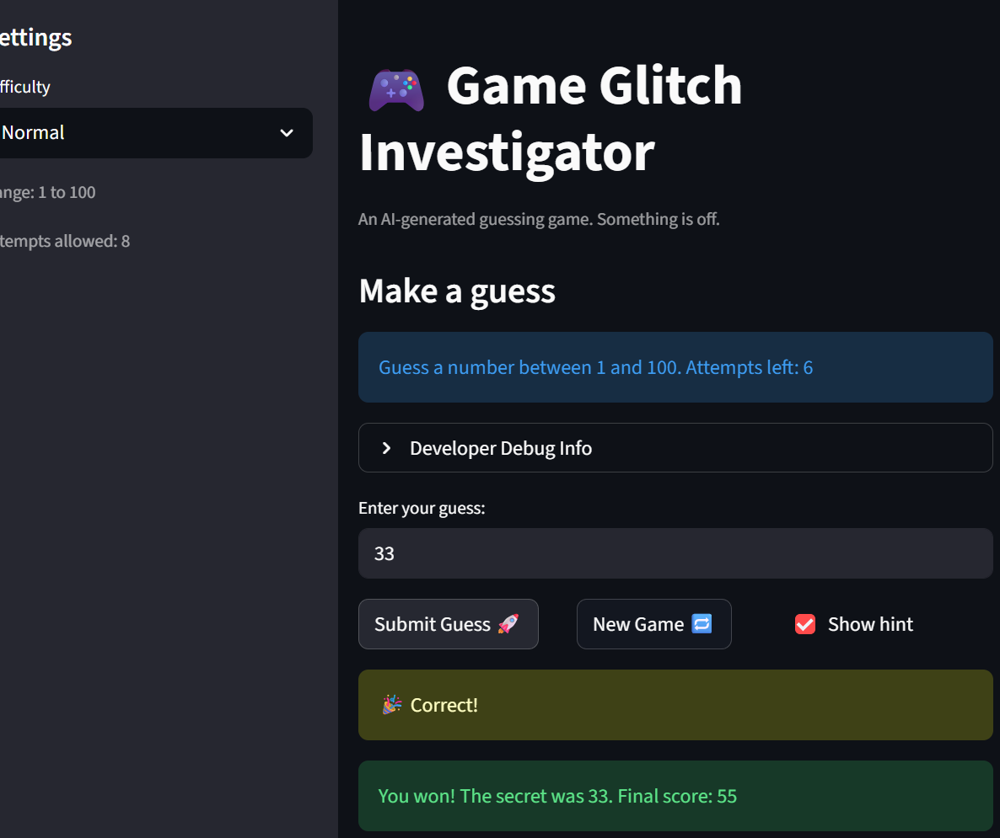

# 🎮 Game Glitch Investigator: The Impossible Guesser

## 🚨 The Situation

You asked an AI to build a simple "Number Guessing Game" using Streamlit.
It wrote the code, ran away, and now the game is unplayable. 

- You can't win.
- The hints lie to you.
- The secret number seems to have commitment issues.

## 🛠️ Setup

1. Install dependencies: `pip install -r requirements.txt`
2. Run the broken app: `python -m streamlit run app.py`

## 🕵️‍♂️ Your Mission

1. **Play the game.** Open the "Developer Debug Info" tab in the app to see the secret number. Try to win.
2. **Find the State Bug.** Why does the secret number change every time you click "Submit"? Ask ChatGPT: *"How do I keep a variable from resetting in Streamlit when I click a button?"*
3. **Fix the Logic.** The hints ("Higher/Lower") are wrong. Fix them.
4. **Refactor & Test.** - Move the logic into `logic_utils.py`.
   - Run `pytest` in your terminal.
   - Keep fixing until all tests pass!

## 📝 Document Your Experience

Glitchy Guesser is a number guessing game built with Streamlit where the player tries to guess a randomly generated secret number within a limited number of attempts. The game supports three difficulty levels (Easy, Normal, and Hard) that control the range of possible numbers and the number of attempts allowed. After each guess, the player receives a hint telling them whether to guess higher or lower, and a score is tracked throughout the session that rewards correct guesses and penalizes wrong ones.
Bugs Found
Seven bugs were identified in the original app.py. Hard mode returned a range of 1–50, which was actually narrower and easier than Normal's 1–100, inverting the intended difficulty scaling. The hint messages in check_guess were backwards — a guess that was too high told the player to go higher, and a guess that was too low told the player to go lower. The scoring function rewarded +5 points for a "Too High" guess on even-numbered attempts, meaning wrong guesses could increase your score. On even-numbered attempts the secret number was cast to a string, causing lexicographic comparisons where "7" > "42" evaluated to True and broke the game logic silently. The New Game button reset the attempt counter to 0 instead of 1, creating an off-by-one inconsistency with how attempts were initialized. The info banner always displayed "Guess a number between 1 and 100" regardless of difficulty, showing the wrong range on Easy and Hard. Finally, the New Game button generated a new secret using randint(1, 100) instead of the difficulty-appropriate range.
Fixes Applied
All four logic functions were extracted from app.py into a dedicated logic_utils.py module. Hard mode's range was corrected to 1–200 so difficulty scales upward as expected. The hint messages were swapped so they point in the correct direction. The scoring function was simplified so both "Too High" and "Too Low" always deduct 5 points with no conditional reward. The string-cast of the secret on even attempts was removed entirely, keeping the secret as an integer at all times. The New Game handler was updated to reset attempts to 1, use randint(low, high) for the new secret, and also reset score, status, and history to fully restore game state. The info banner was updated to use the dynamic {low} and {high} variables. All fixes were verified by a 23-case pytest suite that passed in full.

## 📸 Demo

## 🚀 Stretch Features

- [ ] [If you choose to complete Challenge 4, insert a screenshot of your Enhanced Game UI here]
